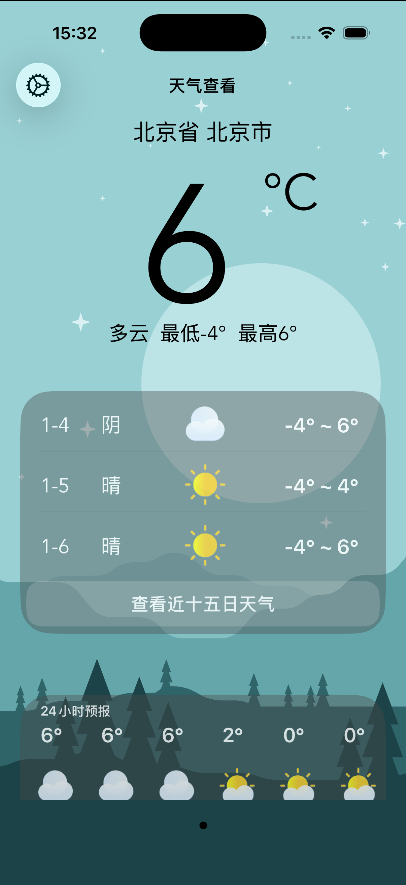
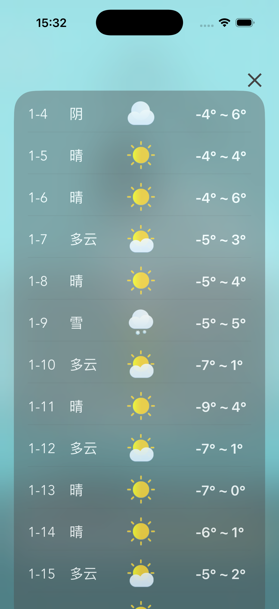
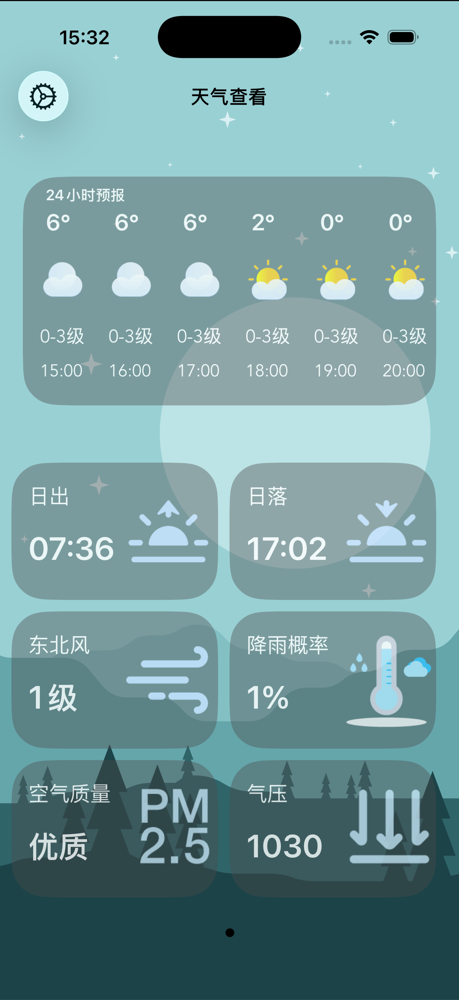
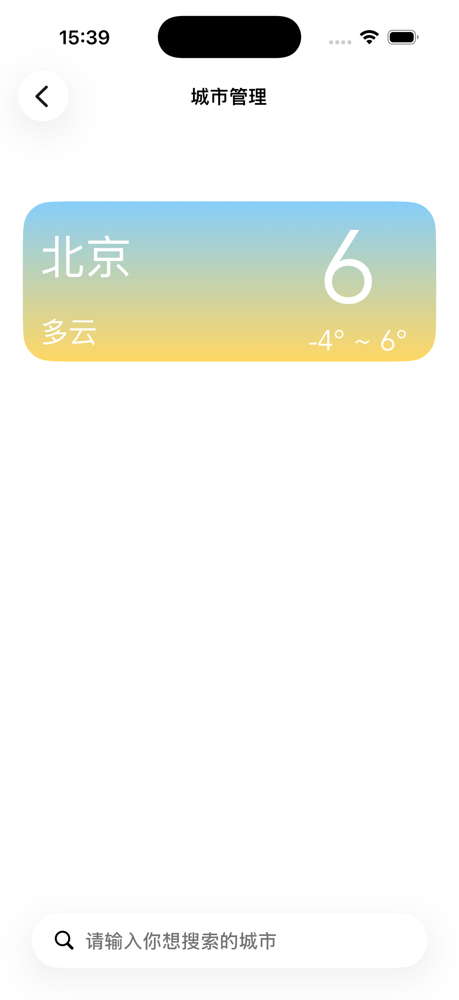
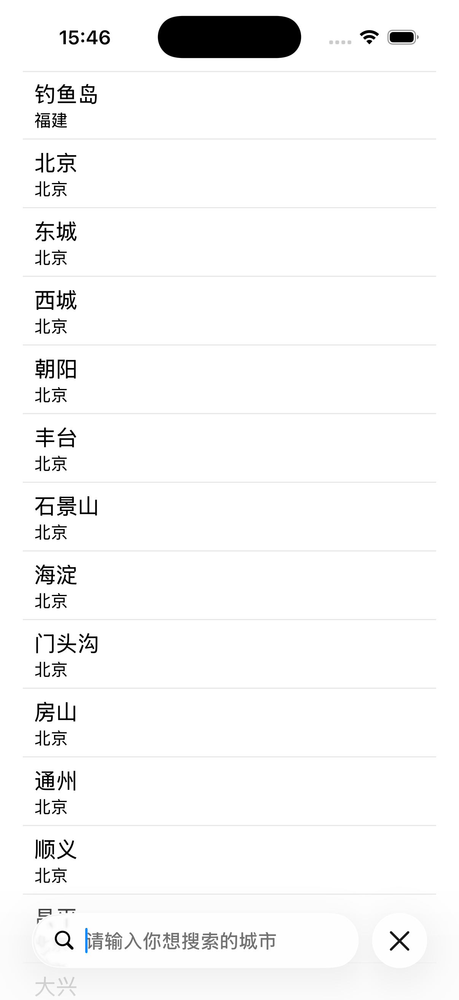

# WeatherDemo

> 一款模仿市面上主流天气App功能的Demo
---

- 本地搜索全国所有城市，并添加该城市的天气情况。
- 可以查看进十五天的气温，24小时的气温情况，以及风向和空气质量。

---

## 项目截图

<p align="left">
  
  
  
  
  
</p>

---

##  技术栈（Tech Stack）

* 前端：Swift，UIkit
* 后端：万维易源天气key及API
* 数据库：ios自带的coredata数据库

---

##  快速开始（Getting Started）

### 克隆并打开项目

```bash
git clone https://github.com/zhaijiang152/WetherDemo.git
cd WetherDemo
open WetherDemo.xcodeproj
```


